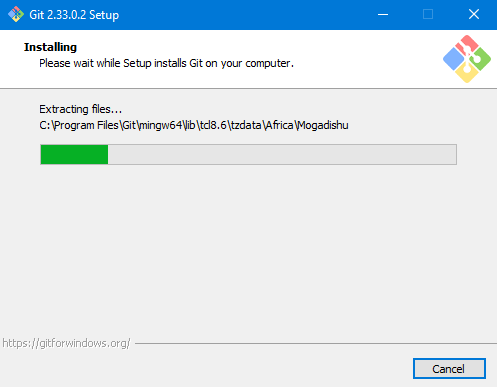
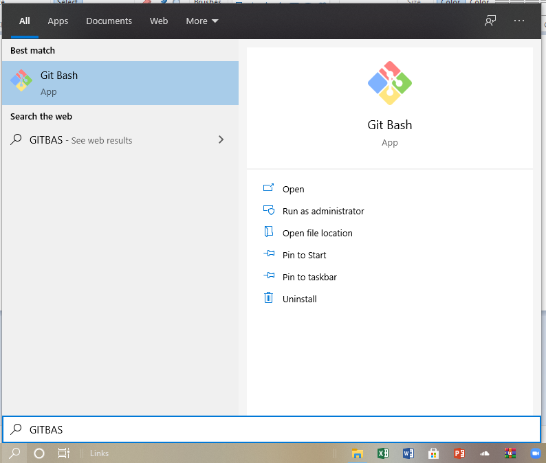

# LAT1
## Instalasi dan Konfigurasi Repository GitHub

### Langkah Download - Instalasi
- Buka link [GIT_download](https://git-scm.com/download/win)

- Klik Download

- Tunggu Sebentar setelah berhasil download install Git-nya

 

 - Berikut tahapan singkat instalasinya

#### Sign-Up GitHub
- Buka link [GitHub](https://github.com)

- Ikuti tahapannya sebagai berikut: 

- Sign Up menggunakan email yang sudah terdaftar

- Akhiri pembuatan akun dengan <b>Continue for free<b>

#### Konfigurasi Singkat GIT Repository
- Buka GITBASH di <b>windows search<b>

- Buatlah Folder yang akan dijadikan <b>repository<b>, untuk ini hal ini saya letakkan repository di D:\LAB\LAT1

- lalu clone-kan dengan perintah , contoh <b>git clone https://github.com/ariandto/LAT1.git

- Pembuatan README.md di akun GitHub

- Setiap perubahan pada visual code (compiler) pastikan pada GitBash sudah dilakukan perubahan pada file README.md dengan perintah sebagai berikut

<b>git add README.md<b>

<b>git commit -m "perubahan1"<b>

<b>git push -u origin main<b>

#### Keterangan 
- <b>git add README.md<b> berfungsi untuk mengupdate file tersebut sebelumnya telah ada perubahan

- <b>git commit -m "peubahan1"<b> contoh komentar atau keterangan dalam perubahan

- <b>git push -u origin main<b> perintah untuk upload perubahan ke repository GitHub

