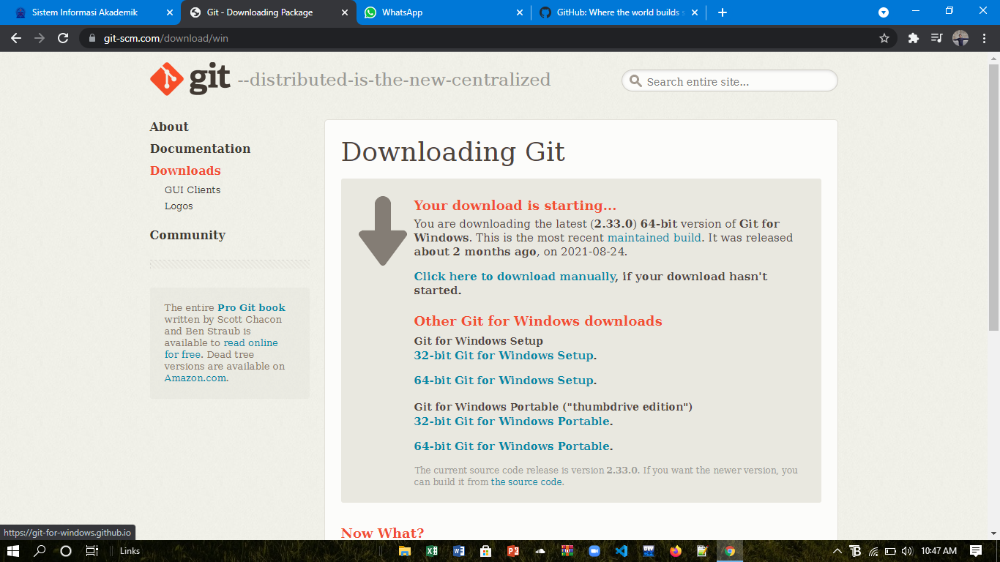
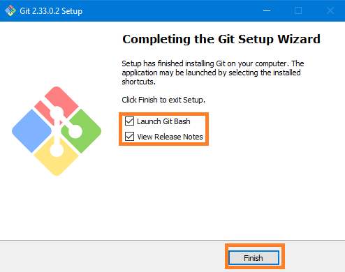

# LAT1
## TUTORIAL GitHub

### Langkah Download - Instalasi
- Buka link [GIT_download](https://git-scm.com/download/win)

- Klik Download

- Tunggu Sebentar setelah berhasil download install Git-nya

 

 - Berikut tahapan singkat instalasinya

#### Sign-Up GitHub
- Buka link [GitHub](https://github.com)

- Ikuti tahapannya sebagai berikut: 

- Sign Up menggunakan email yang sudah terdaftar

- Akhiri pembuatan akun dengan <b>Continue for free<b>

